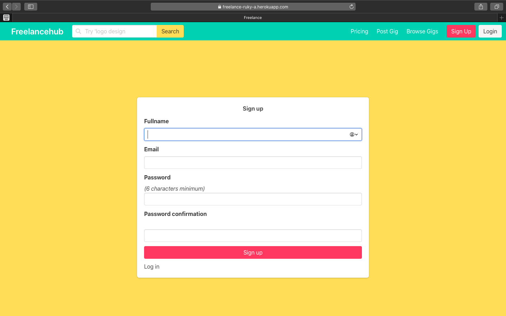
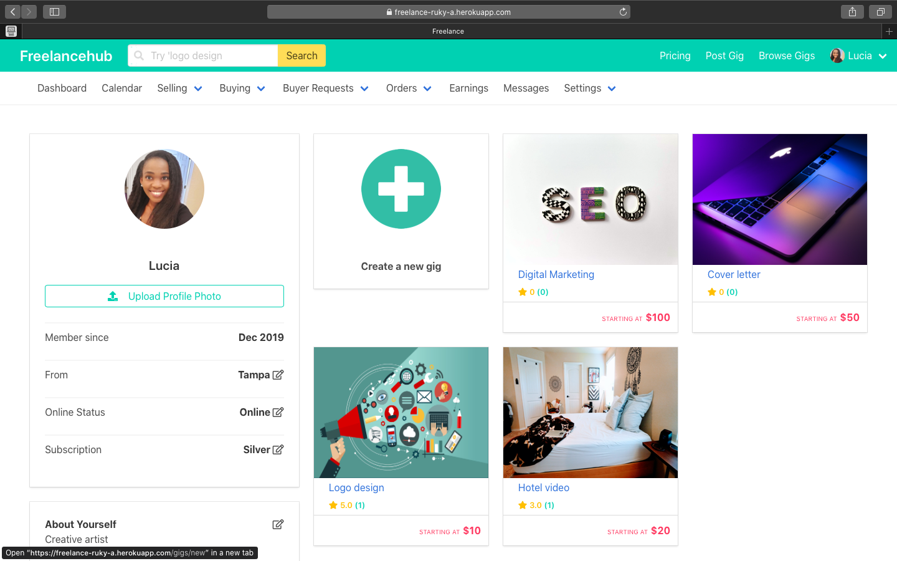
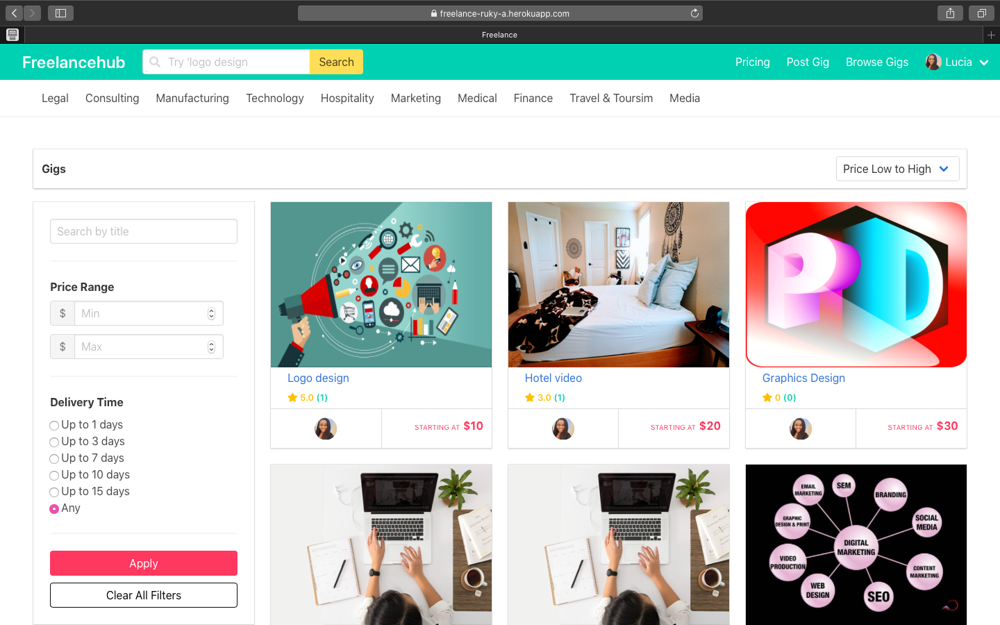
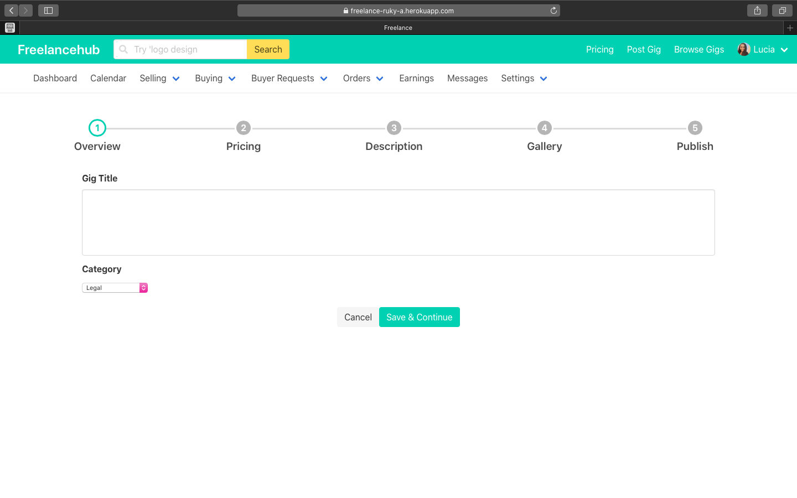
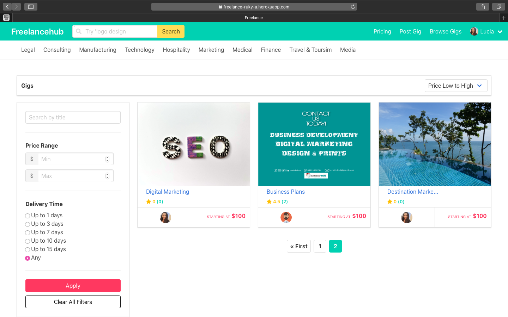

# Freelance Marketplace

This app allow users to create account and add digital freelance services. It is a two way market place and users can create gigs and purchase gigs. Stripe Api is integrated for payments.

## Click [here](https://freelance-ruky-a.herokuapp.com/) for the live app.

 Tools & Resources

  * Built with ruby on rails and bulma-css

  * Ruby version 2.6 with Rails 6

  * Database: Postgresql

  * Admin backend with Trestle
 
  * Payment with Stripe-api
 
  * Payout with Paypal

  
  This is the home page:

  

  This is Sign-up page for new users:

  

  This is the user dashboard page:

  

  This is the subscription page:

  

  Users can add new gig: 

  
  

  Gig listing: 

  
  

  Gig showpage: 

  

  Order gig page: 

  

  
 
